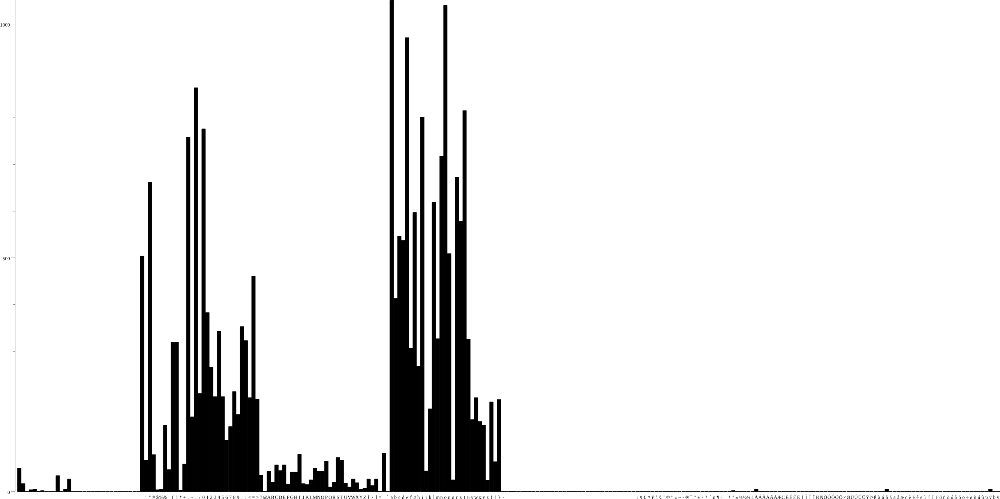

# pcaphistogram

Generates a byte frequency from a pcap file and optionally renders it

Loosely based on what I could tell http://www.willhackforsushi.com/code/pcaphistogram.pl.txt does

# Usage

    $ go get github.com/ncsa/pcaphistogram
    $ pcaphistogram hist ~/tmp/google_curl.pcap |head -n 20
    40 packets processed
    0	50
    1	17
    2	0
    3	4
    4	5
    5	1
    6	2
    7	0
    8	0
    9	0
    10	34
    11	0
    12	5
    13	27
    $ pcaphistogram plot ~/tmp/google_curl.pcap example_output/google_curl.png
    

